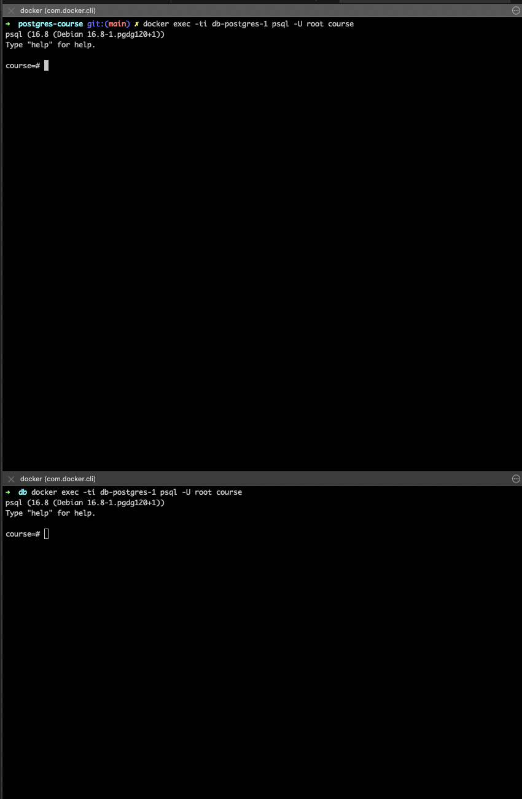
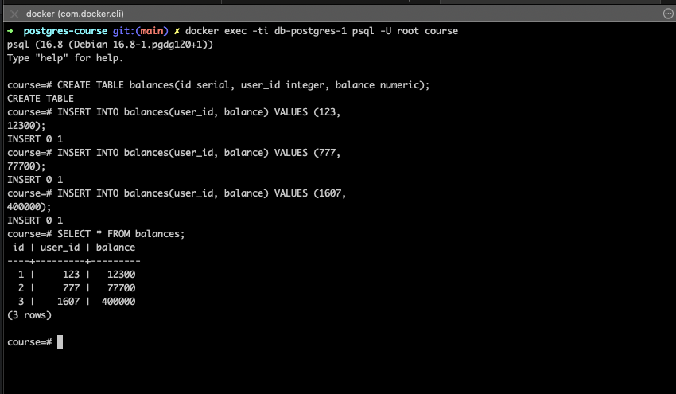
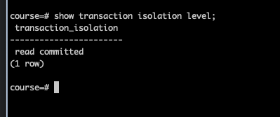
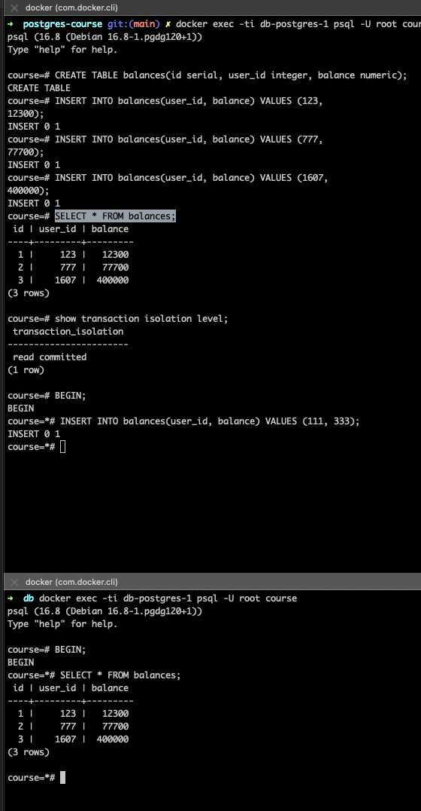
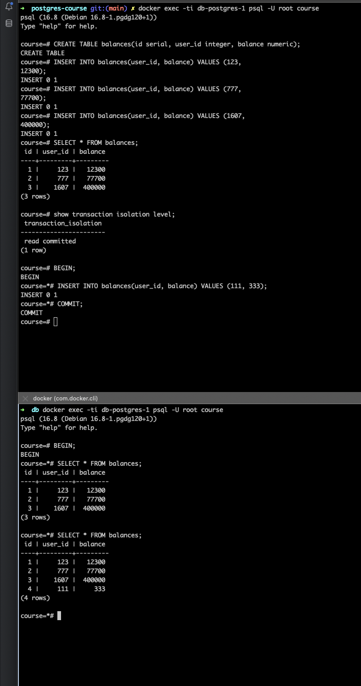
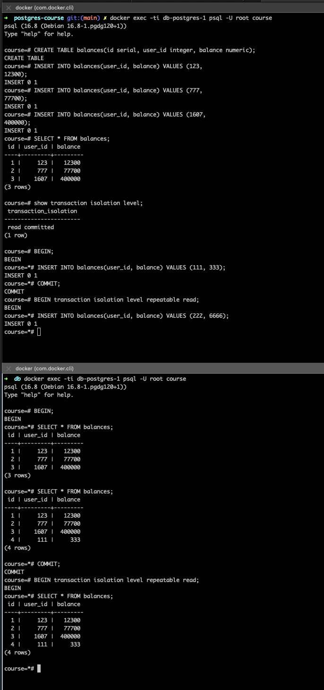
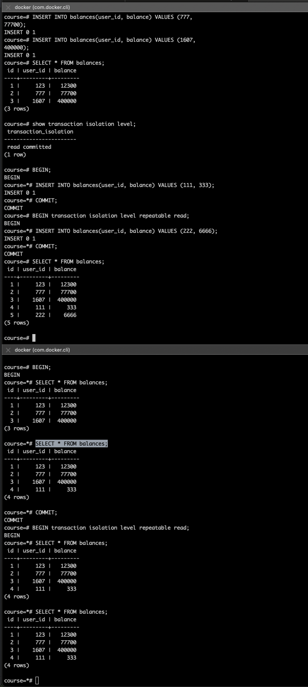

## Домашнее задание ко второй лекции от Сагдиева Руслана

1. Запустил Postgres в Docker на локальной машине

2. Открыл две консоли и подключился к одному инстансу Postgres

3. Создал таблицу balances и заполнил ее 

4. Текущий уровень изоляции: read commited. Дефолтный в Postgres
  
5. В обеих сессия начал транзакции не меняя уровень изоляции. \
   В первой сессии добавил новую запись  
   >  INSERT INTO balances(user_id, balance) VALUES (111, 333);

    Во второй сессии запросил все данные таблицы balance. Результат не изменился.
    
   

   ### Почему не изменились данные ?
   >  Данные остались неизмененными потому что в первой сессии мы не закоммитили 
   > изменения после добавления новой записи. Так как уровень изоляции по умолчанию read committed
   > он не допускает "грязное" чтение.
    
6. Закоммитил данные в первой транзакции.
7. Во второй сессии вновь повторил запрос на получение всех данных из таблицы balances. \
   И увидел новую запись. Ее видно потому что завершилась транзакция в первой сессии, а read commited 
   допускает неповторяющееся чтение.
   
8. Закончил транзакцию во второй сессии.
9. Открыл в каждой из сессий новуые транзакции, но уже с уровнем repeatable read
10. Добавил новую запись в первой сессии. Сделал выборку во второй сессии. Все также не видно, 
    потому что уровень repeatable read также не допускает "грязное чтение"
    
11. Сделал COMMIT; в первой сессии. 
12. Во второй сессии запросил все данные из таблицы balances.\
    Новую запись не видно, хотя в первой сессии данные видны. \
    Это происходит так как уровень repeatable read не допускает "неповторяющееся чтение"
    