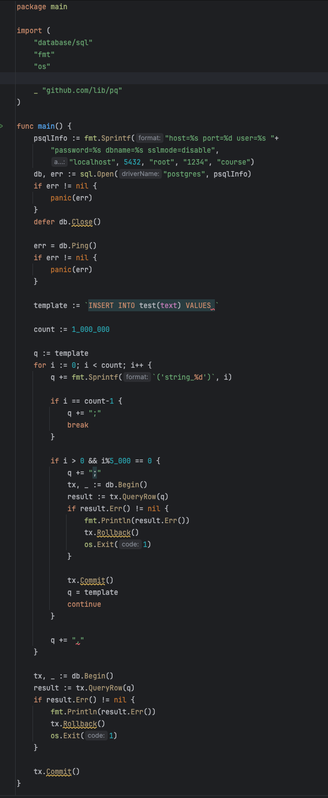
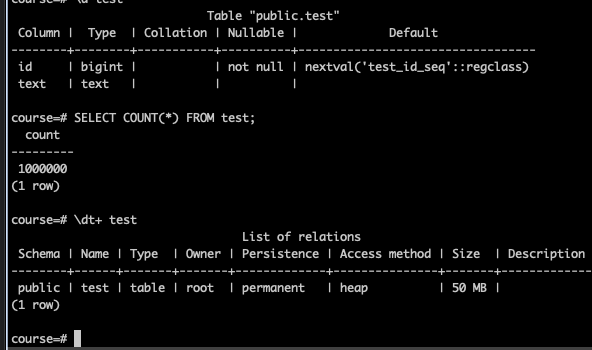
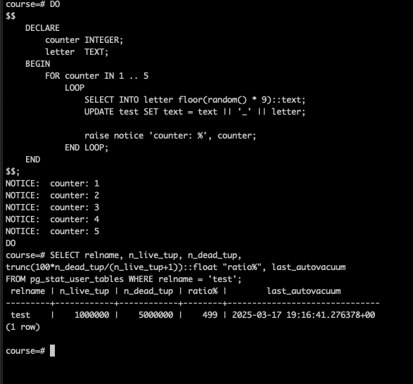
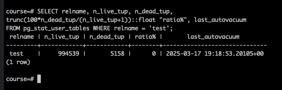
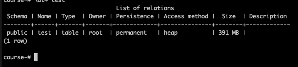
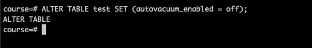
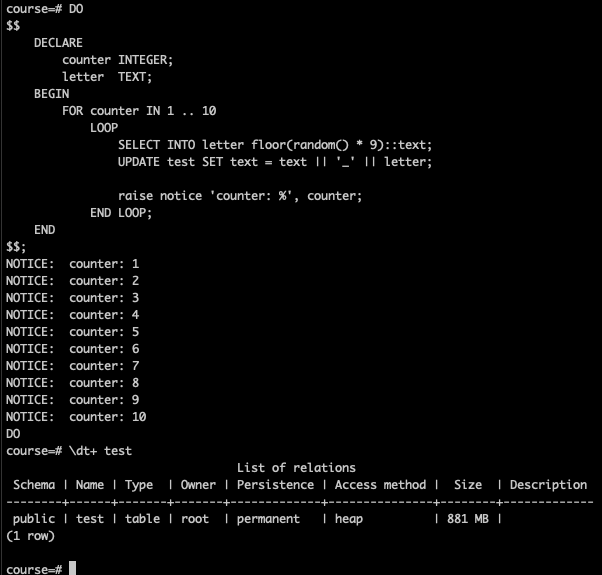

## Домашнее задание к третьей лекции от Сагдиева Руслана


1.  Создал таблицу test и скриптом заполнил ее 1млн строк.
> P\S скрипт топорныё, накидал на коленке :)



2. В результате получилась таблица весом 50Мб.

   
3. Написал анонимную процедуру, которая обновлеят все строки N раз и добавляет в конец строки одну случайную цифру.
```sql
DO
$$
    DECLARE
        counter INTEGER;
        letter  TEXT;
    BEGIN
        FOR counter IN 1 .. 10
            LOOP
                SELECT INTO letter floor(random() * 9)::text;
                UPDATE test SET text = text || '_' || letter;

                raise notice 'counter: %', counter;
            END LOOP;
    END
$$;
``` 
4. Запустил ее на 5 повторений. И после выполнения сразу посмотрел кол-во мертвых строчек и когда отработал автовакум
 

5. Подождал некоторое время и вновь запросил кол-во мертвых строчек и когда отработал автовакум
   

6. Вновь запустил процедуру на 5 повторения и посмотрел размер таблицы


7. Отключил автовакум для таблицы test
      

8. Вновь запустил анонимную функцию, только в этот раз на 10 проходов. Таблица увеличилась более чем в 2 раза.
> Это произошло потому что при выполнении UPDATE создается новая записа, а старая помечается на удаление. 
> А так как автовакуум выключен то удаление не происходит.  

   
9. Включи автовакум обратно.
