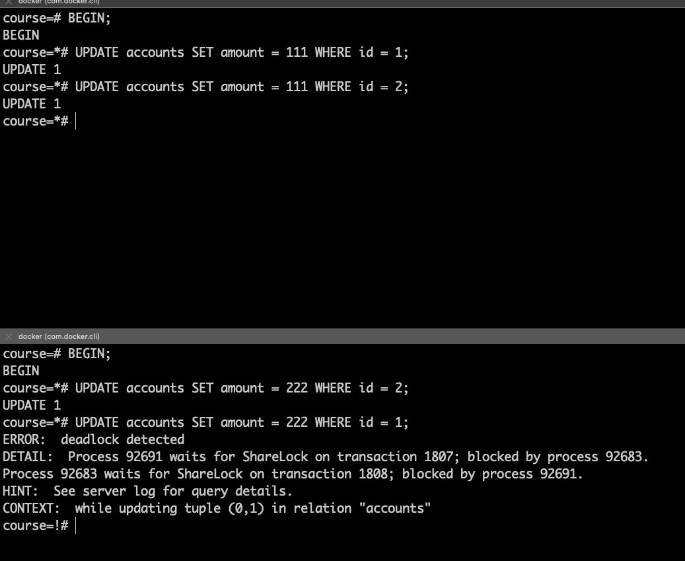

## Домашнее задание к четвертой лекции от Сагдиева Руслана

1.  Создал таблицу accounts и заполнил данными.

   

2. Чтобы создать deadloack нужно, чтобы две транзакции начали изменять заблокированные друг другом строки. \
    Для этого в первой сессия я открыл транзакцию и выполнил запрос на изменение строки с id=1 \
    Далее во второй сессии я также открыл транзакцию и начал изменять строку с id=2
      
    
   
3. Далее в рамках первой сессии я выполнил запрос на изменение баланса у строки с id=2,а 
 во второй сессии попытался выполнить запрос на изменение баланса у строки с id=1. \
 Сразу после этого во второй сессии появилось сообщение о возникновении дедлока
    

   
4. Заглянул в логи контейнера и увидел лог постгреса о дедлоке
    
