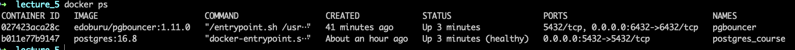
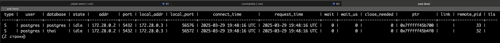
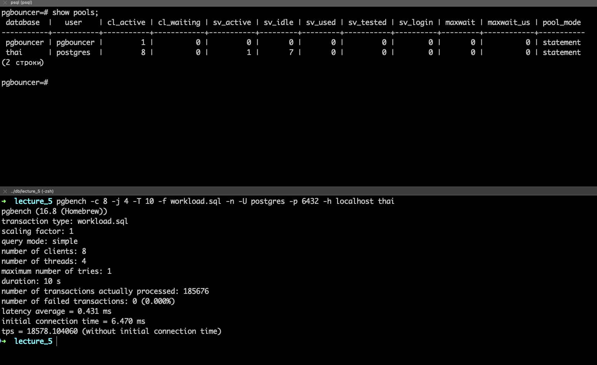
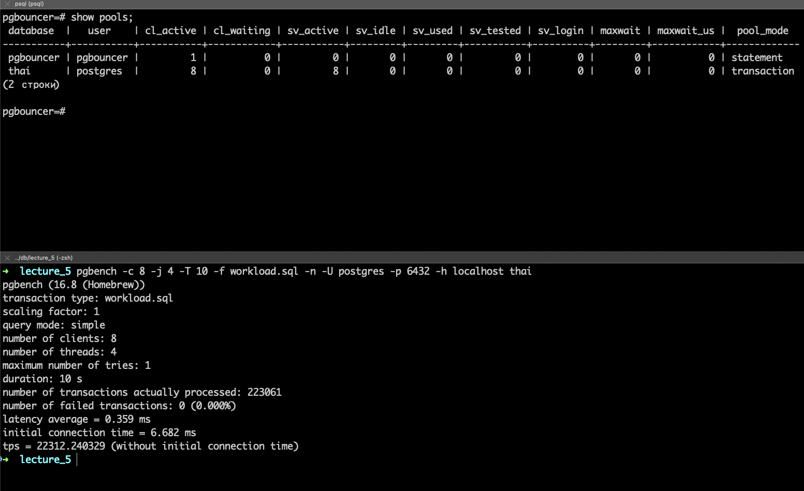

## Домашнее задание к пятой лекции от Сагдиева Руслана

1.  Поднял Postgres и PgBouncer локально в докере  



2. Подключился к PgBouncer и выполнил команду PgBouncer
   


3. Создал файл workload.sql как в примере из лекции
```sql
\set r random(1, 5000000)
SELECT * FROM book.tickets WHERE id = :r;

``` 
4. Установил для PgBouncer pool_mode = statement
5. Запустил pgbench и в результате получил **18578**. Сверху над выводом результатов в админке PgBouncer вызываю команду **show pools;**
```bash
pgbench -c 8 -j 4 -T 10 -f workload.sql -n -U postgres -p 6432 -h localhost thai
```


6. Установил для PgBouncer pool_mode = session и получил **21430**


7. Установил для PgBouncer pool_mode = transaction и получил **22312**



### Вывод
Самым медленны оказался режим **session**, так как соединение будет освобождаться после выполнения каждого отдельного выражения.\
**Session** оказался промежуточным вариантом, так как клиент может продолжать отправлять запросы до тех пор, пока продолжается сессия.\
И самым производительным на текущих тестовых данных оказался режим **transactions**, так как после завершения транзакции \
соединение возвращается в общий пул
