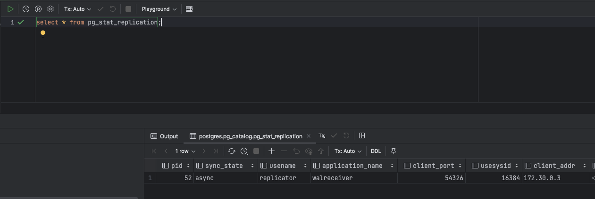
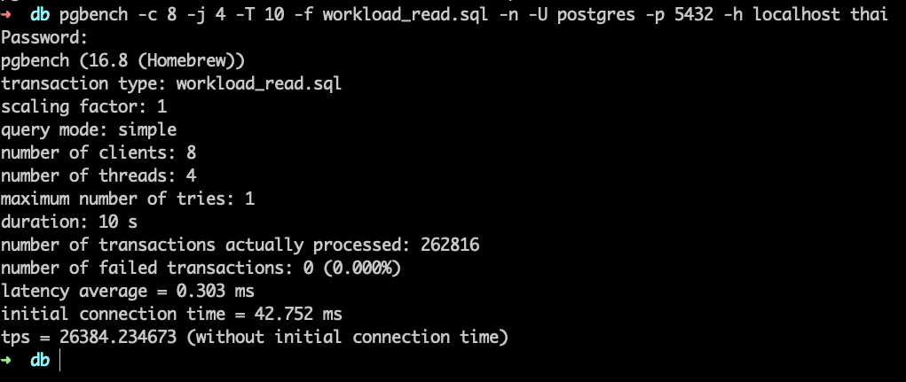
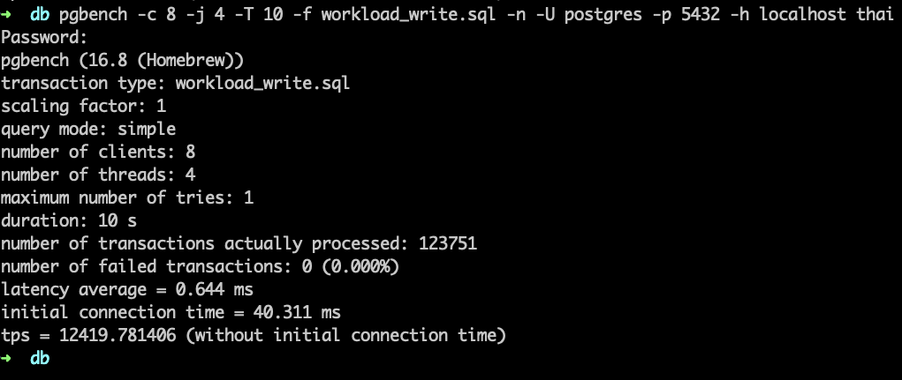
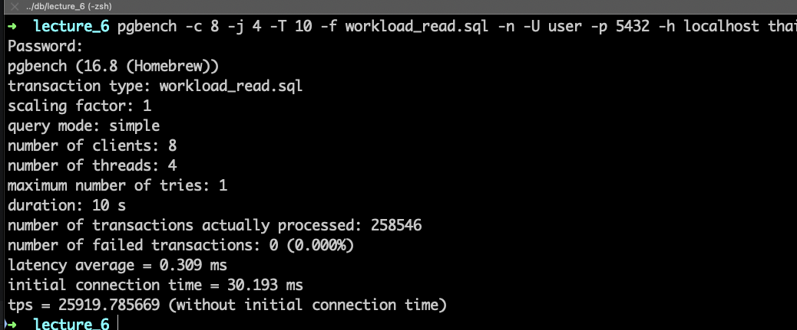
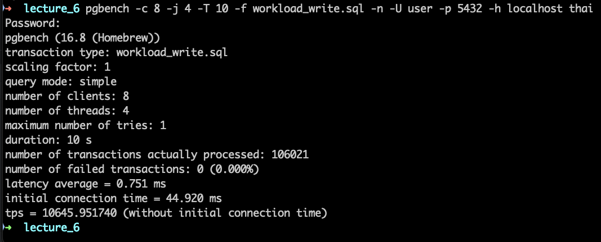
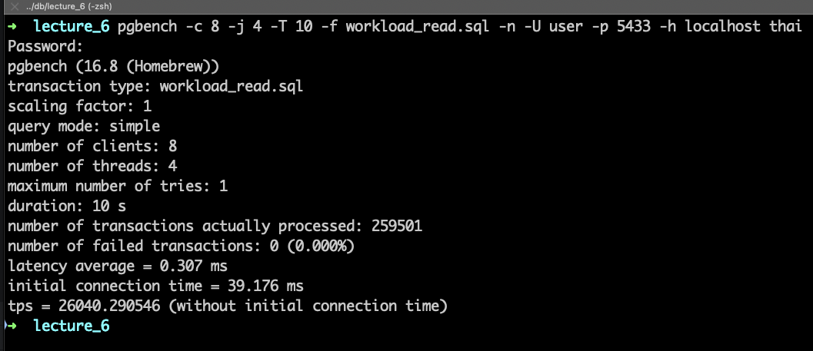

## Домашнее задание к шестой лекции от Сагдиева Руслана

1.  Поднял две конфигурации Postgres:
    1. в конфигурации master + 1 async replica 
    
    2. сингл инстанс
       

2. Подготовил два файла для тестирования
    * workload_read.sql
```sql 
\set r random(1, 5000000) 
SELECT * FROM book.tickets WHERE id = :r;
```

    * workload_write.sql

```sql 
INSERT INTO book.tickets (fkRide, fio, contact, fkSeat)
VALUES (
           ceil(random()*100)
       , (array(SELECT fam FROM book.fam))[ceil(random()*110)]::text || ' ' ||
         (array(SELECT nam FROM book.nam))[ceil(random()*110)]::text
       ,('{"phone":"+7' || (1000000000::bigint + floor(random()*9000000000)::bigint)::text || '"}')::jsonb
       , ceil(random()*100));
```
    
3. Запустил тест на чтение с сингл инстанса
   
4. Запустил тест на запись с сингл инстанса
   
5. Запустил тест на чтение на мастер
      
6. Запустил тест на запись с мастера
   
7. Запустил тест на чтение с реплики
   

### Выводы
* Чтение на сингл инстансе, мастере и реплике отличаются в рамках погрешности.\
Так что считаем что одинаково справились. Но вот при реальной продовой нагрузке результаты будут отличаться.
* Запись на сингл инстанс и мастер уже отличаются заметнее. Все же ассинк репликация дает о себе знать. \
А если была бы синхронная то все было бы куда медленнее.
