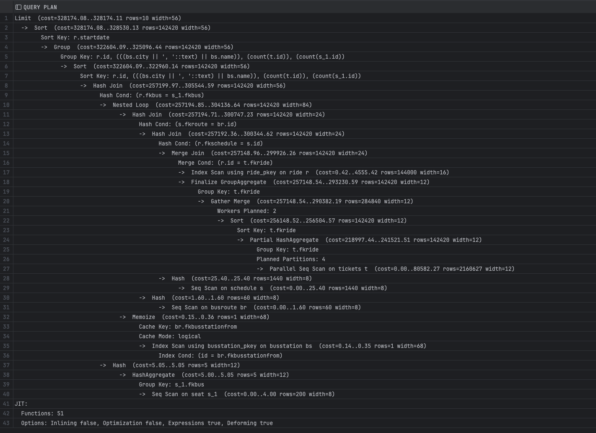
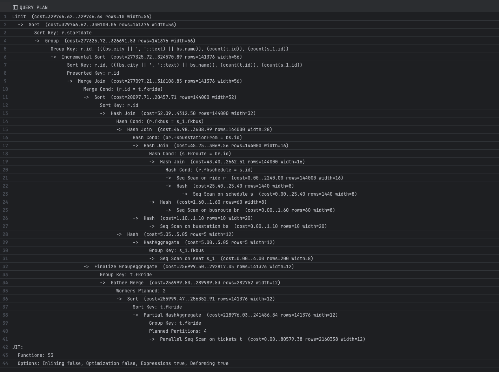

## Домашнее задание к седьмой лекции от Сагдиева Руслана

1.  В свежий postgres залил тайские перевозки, минимальную версию и выполнил запрос:  
```sql
explain
WITH all_place AS (
    SELECT count(s.id) as all_place, s.fkbus as fkbus
    FROM book.seat s
    group by s.fkbus
),
     order_place AS (
         SELECT count(t.id) as order_place, t.fkride
         FROM book.tickets t
         group by t.fkride
     )
SELECT r.id, r.startdate as depart_date, bs.city || ', ' || bs.name as busstation,
       t.order_place, st.all_place
FROM book.ride r
         JOIN book.schedule as s
              on r.fkschedule = s.id
         JOIN book.busroute br
              on s.fkroute = br.id
         JOIN book.busstation bs
              on br.fkbusstationfrom = bs.id
         JOIN order_place t
              on t.fkride = r.id
         JOIN all_place st
              on r.fkbus = st.fkbus
GROUP BY r.id, r.startdate, bs.city || ', ' || bs.name, t.order_place,st.all_place
ORDER BY r.startdate
limit 10;
```

И получил вот такой план выполнения


2. Далее навесил индексы на внешние ключи
```sql
CREATE INDEX CONCURRENTLY fkschedule_ride_idx
    on book.ride USING BTREE (fkschedule);

CREATE INDEX CONCURRENTLY fkroute_schedule_idx
    on book.schedule  USING BTREE (fkroute);

CREATE INDEX CONCURRENTLY fkbusstationfrom_busroute_idx
    on book.busroute USING BTREE (fkbusstationfrom);

CREATE INDEX CONCURRENTLY fkride_tickets_idx
    on book.tickets USING BTREE (fkride);

CREATE INDEX CONCURRENTLY fkbus_ride_idx
    on book.ride USING BTREE (fkbus);
```
   
и вновь выполнил запрос получив вот такой результат:


3. План запроса изменился, но стоимость запроса особо не изменилась

